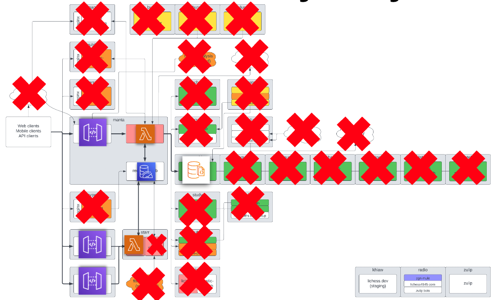

# lichess-on-aws-benchmark
The project was carried out as part of a master's thesis at the 
[Department of Computer Science and Telecommunications, Poznan University of Technology](https://cat.put.poznan.pl/), 
under the supervision of dr inż. Adam Wojciechowski (PhD). 

Thesis title: **Evaluation of serverless processing on the AWS platform using Lichess.org as a test case.**

## Description
This project aims to port the core architecture of [Lichess.org](https://lichess.org) to the 
AWS platform using serverless processing services (AWS Lambda, AWS API Gateway, etc.)
to perform performance measurements.

If possible, all services on AWS will be used with the [AWS Free Tier](https://aws.amazon.com/free) plan 
to minimize the cost of such a study

This project will be divided into 2 stages:
- **Stage 1** - Uploading the Lichess.org project in almost unchanged form to the AWS platform while analyzing the code 
to familiarize the project and develop an optimization plan for the next phase.
Prepare test scenarios and take measurements.
- **Stage 2** - Optimize code for serverless processing, remove unnecessary modules, move some functionality to separate AWS services (e.g., frontend to S3), 
etc.... Restart the test scenarios and save the measurement results.

Services code versions used for the project:
- [**lila**](https://github.com/lichess-org/lila/tree/5836abda88c6e07ea91e9e94aa22fbae97368f2b)
- [**lila-ws**](https://github.com/lichess-org/lila-ws/tree/492546c1d37dbde3887de7c08e2fc8a3dad09d13)

## Architectures
### Stage 1

### Stage 2
**TBD...**